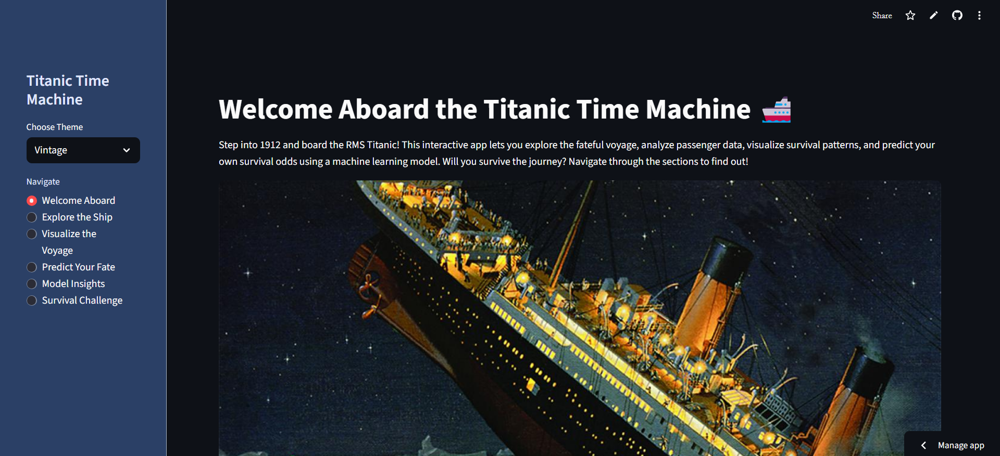
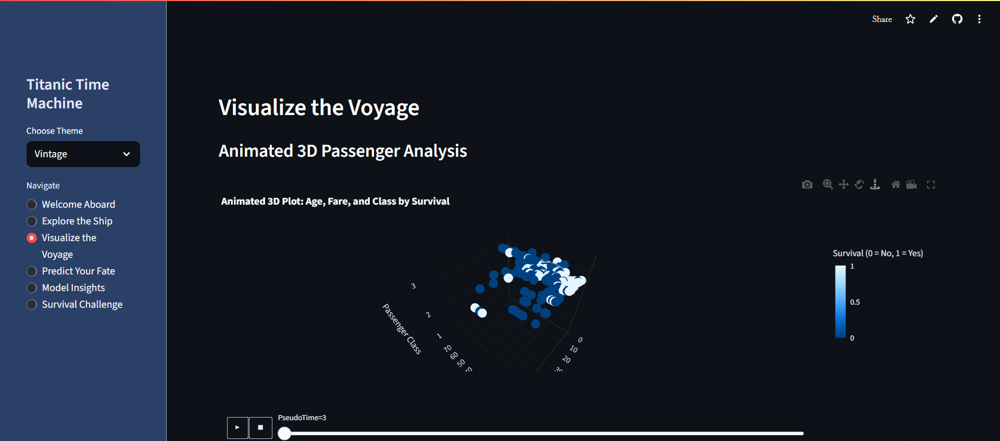
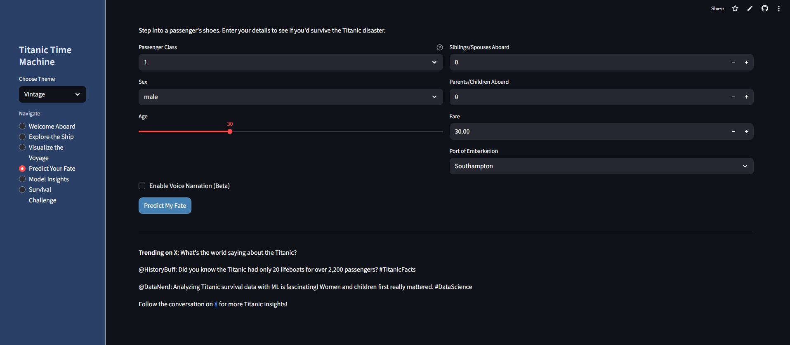

# 🚢 Titanic Survival Prediction

This project is an interactive **Streamlit web application** that predicts whether a passenger survived the Titanic disaster using a pre-trained **Random Forest** machine learning model.  

Users can explore the Titanic dataset, view interactive visualizations, test the prediction model with custom inputs, and review model performance metrics.

---

## 📂 Project Structure
```
.
├── app.py                  # Main Streamlit app
├── model_training.ipynb    # Jupyter notebook for training the model
├── model.pkl               # Pre-trained Random Forest model
├── data/
│   └── Titanic-Dataset.csv # Dataset file
└── requirements.txt        # Python dependencies
```

---

## ⚙️ Features

### 1️⃣ **Data Exploration**
- View dataset overview (shape, columns, types)
- Filter and explore selected columns interactively

### 2️⃣ **Visualizations**
- **Survival by Passenger Class** – Histogram
- **Age Distribution by Survival**
- **Fare vs Age by Survival** – Interactive scatter plot

### 3️⃣ **Model Prediction**
- Input passenger details:
  - Passenger class (Pclass)
  - Gender
  - Age
  - Siblings/Spouses aboard (SibSp)
  - Parents/Children aboard (Parch)
  - Fare
  - Port of Embarkation
- View survival prediction and probability

### 4️⃣ **Model Performance**
- Accuracy, Precision, Recall, F1 Score
- Confusion matrix visualization

---

## 📊 Dataset
The dataset is sourced from the **Kaggle Titanic: Machine Learning from Disaster** competition.

**Key Features Used:**
- `Pclass` – Passenger class (1–3)
- `Sex` – Gender
- `Age`
- `SibSp` – Siblings/Spouses aboard
- `Parch` – Parents/Children aboard
- `Fare`
- `Embarked` – Port of Embarkation

---

## 🖥 Installation & Usage

### **1. Clone the repository**
```bash
git clone https://github.com/your-username/titanic-survival-prediction.git
cd titanic-survival-prediction
```

### **2. Install dependencies**
```bash
pip install -r requirements.txt
```

### **3. Run the app**
```bash
streamlit run app.py
```

### **4. Access in browser**
Once running, open:
```
http://localhost:8501
```

---

## 🧠 Model Information
- **Algorithm:** Random Forest Classifier
- **Training Process:** Implemented in `model_training.ipynb`
- **Evaluation:** Uses 80/20 train-test split with key classification metrics

---

## 📷 Screenshots





---

## 📜 License
This project is licensed under the MIT License.

